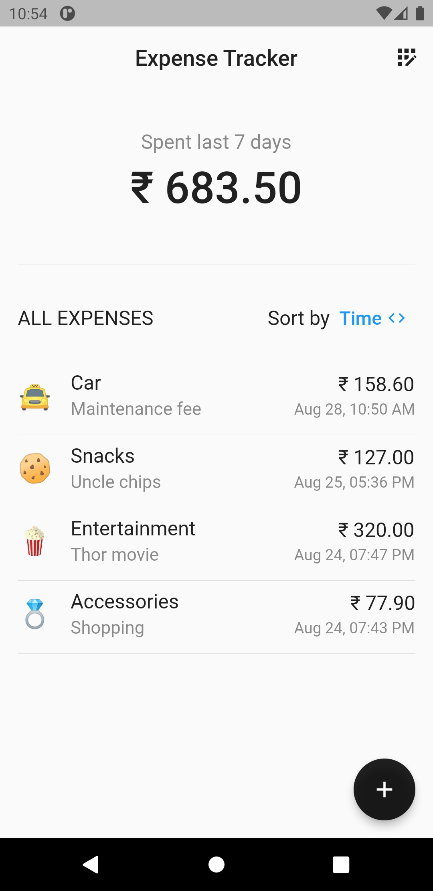
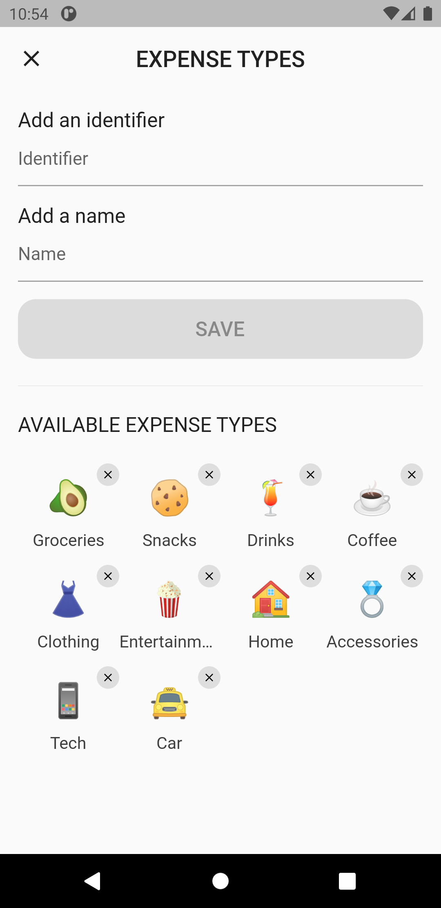
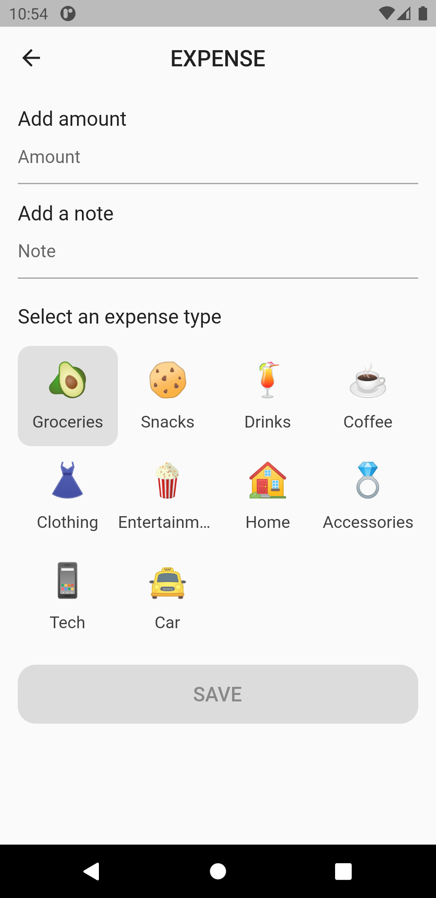

# Flutter ObjectBox Example

Flutter project that shows how to work with ObjectBox - High Performance NoSQL Database.

This project shows - 
- how to persist data locally using [ObjectBox](https://objectbox.io/).
- how to use entities, relations, reactive queries, ordering, and other functionalities.
- how to maintain the codebase with proper architecture and state management techniques.
- how to effectively isolate the presentation layer from the business logic layer using [flutter_bloc](https://pub.dev/packages/flutter_bloc).
- how to inject single instances of repositories using RepositoryProvider.
- how to create forms with validated value objects rather than a primitive object type like String with [formz](https://pub.dev/packages/formz).
- how to work with Streams and Flutter Bloc using `emit.forEach<T>( ... )`.

> **Note** 
> Read the article here on [Medium](https://medium.com/@thecodexhubofficial/flutter-and-objectbox-high-performance-nosql-database-e540b4ae91ee). 👈

> **Note** 
> Check out the **sample video** here on [Instagram](https://www.instagram.com/reel/ChzQW6eIyWU/?utm_source=ig_web_copy_link). 👈

## Preview

   <table>
      <tr>
         <td style="text-align: center">
            
         </td>
         <td style="text-align: center">
            
         </td>
         <td style="text-align: center">
            
         </td>
      </tr>
   </table>

## Getting Started

For help getting started with Flutter development, view the
[online documentation](https://docs.flutter.dev/), which offers tutorials,
samples, guidance on mobile development, and a full API reference.

### If you like this repository, kindly give it a star ⭐
